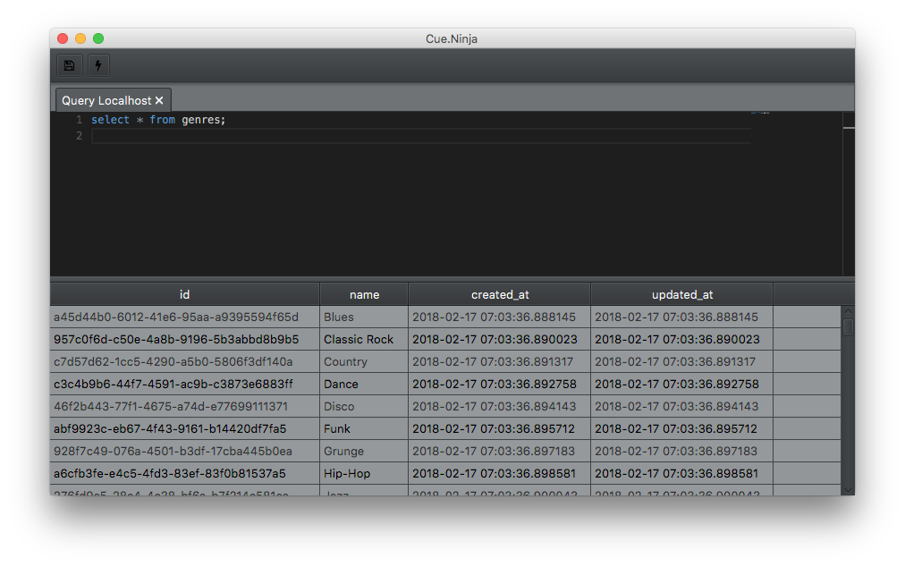
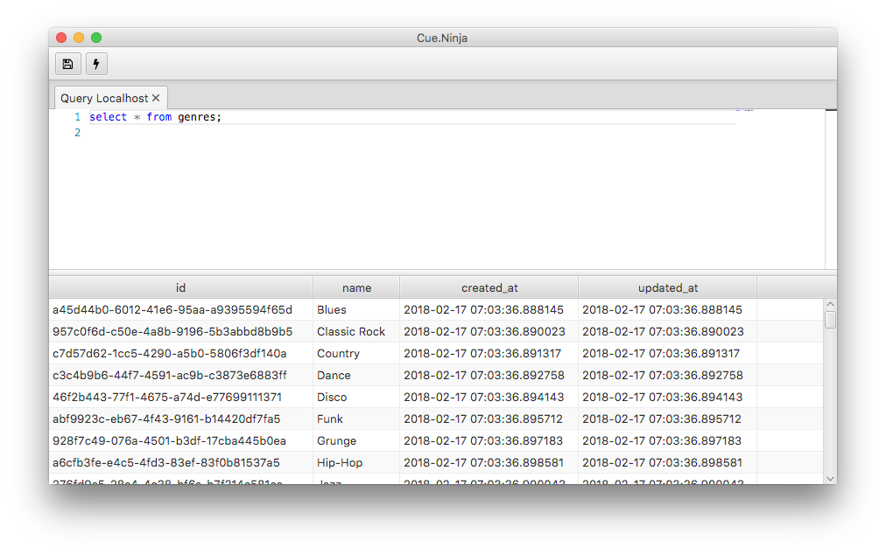

# cue.ninja




cue.ninja will be a cross plaform data query tool.  
There are several tools out there that are more more feture rich and complete, I wanted a tool that was more light weight.

So far all you can do is edit a sql statment and query a specific hard coded local database.

## Building

### Requirements:
* [Java 9](http://www.oracle.com/technetwork/java/javase/downloads/index.html)

### Run
```bash
$ ./gradlew
```

### Build
```bash
$ ./gradlew build-app
```
